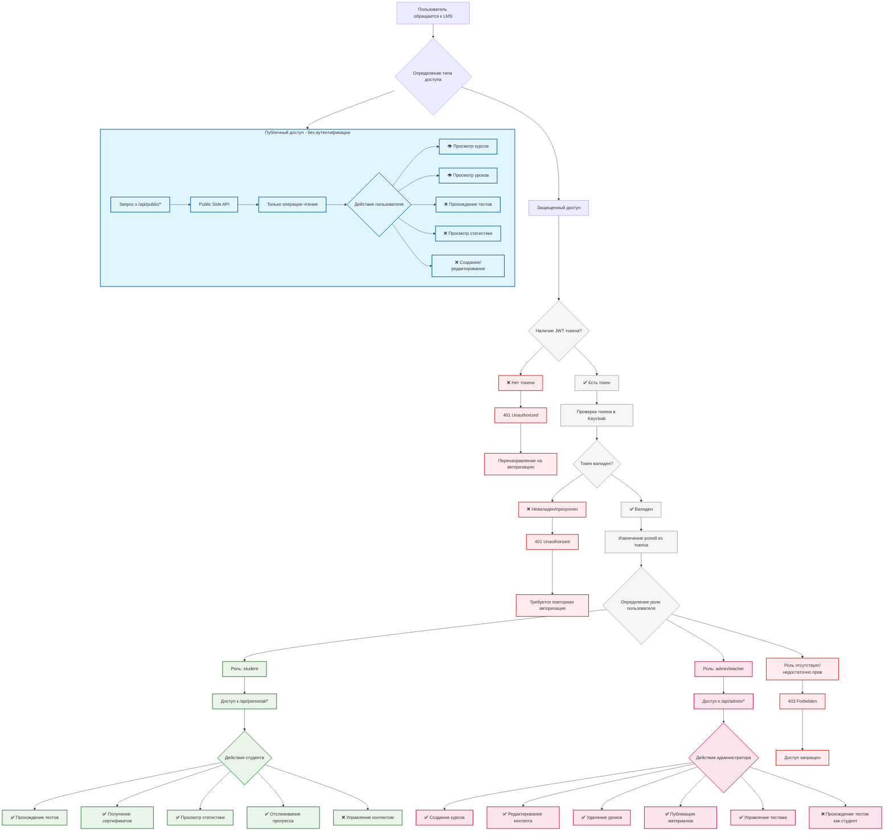
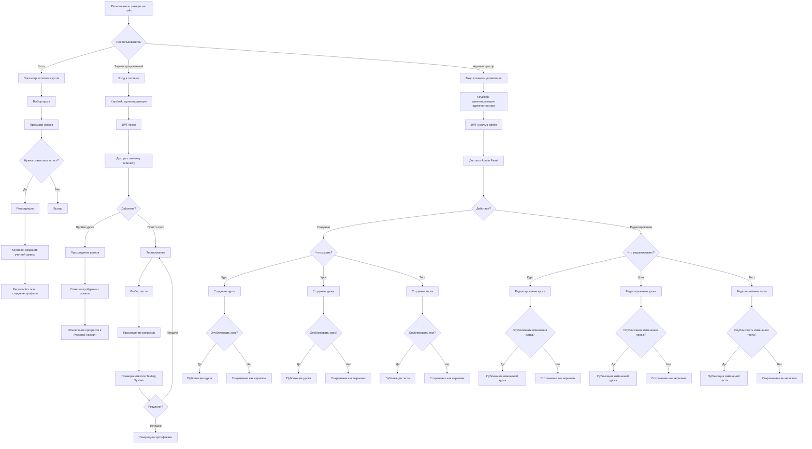

***
title: "Flowchart Диаграммы LMS"
date: $(date +%Y-%m-%d)
***

##Авторизация и аутентификация

```mermaid
flowchart TD
    A[Пользователь обращается к LMS] --> B{Определение типа доступа}
    
    B --> C[Публичный доступ]
    B --> D[Защищенный доступ]
    
    %% Публичный доступ
    subgraph C [Публичный доступ - без аутентификации]
        C1[Запрос к /api/public/*] --> C2[Public Side API]
        C2 --> C3[Только операции чтения]
        C3 --> C4{Действие пользователя}
        C4 --> C5[👁️ Просмотр курсов]
        C4 --> C6[👁️ Просмотр уроков]
        C4 --> C7[❌ Прохождение тестов]
        C4 --> C8[❌ Просмотр статистики]
        C4 --> C9[❌ Создание/редактирование]
    end
    
    %% Защищенный доступ
    D --> E{Наличие JWT токена?}
    
    E --> F[❌ Нет токена]
    F --> F1[401 Unauthorized]
    F1 --> F2[Перенаправление на авторизацию]
    
    E --> G[✅ Есть токен]
    G --> H[Проверка токена в Keycloak]
    H --> I{Токен валиден?}
    
    I --> J[❌ Невалиден/просрочен]
    J --> J1[401 Unauthorized]
    J1 --> J2[Требуется повторная авторизация]
    
    I --> K[✅ Валиден]
    K --> L[Извлечение ролей из токена]
    L --> M{Определение роли пользователя}
    
    %% Студент
    M --> N[Роль: student]
    N --> O[Доступ к /api/personal/*]
    O --> P{Действия студента}
    P --> Q[✅ Прохождение тестов]
    P --> R[✅ Получение сертификатов]
    P --> S[✅ Просмотр статистики]
    P --> T[✅ Отслеживание прогресса]
    P --> U[❌ Управление контентом]
    
    %% Админ/Учитель
    M --> V[Роль: admin/teacher]
    V --> W[Доступ к /api/admin/*]
    W --> X{Действия администратора}
    X --> Y[✅ Создание курсов]
    X --> Z[✅ Редактирование контента]
    X --> AA[✅ Удаление уроков]
    X --> AB[✅ Публикация материалов]
    X --> AC[✅ Управление тестами]
    X --> AD[❌ Прохождение тестов как студент]
    
    %% Неавторизованный доступ
    M --> AE[Роль отсутствует/недостаточно прав]
    AE --> AF[403 Forbidden]
    AF --> AG[Доступ запрещен]
    
    %% Стилизация
    classDef public fill:#e1f5fe,stroke:#01579b,stroke-width:2px
    classDef student fill:#e8f5e8,stroke:#2e7d32,stroke-width:2px
    classDef admin fill:#fce4ec,stroke:#c2185b,stroke-width:2px
    classDef error fill:#ffebee,stroke:#c62828,stroke-width:2px
    classDef success fill:#f1f8e9,stroke:#33691e,stroke-width:1px
    classDef neutral fill:#f5f5f5,stroke:#616161,stroke-width:1px
    
    class C,C1,C2,C3,C4,C5,C6,C7,C8,C9 public
    class N,O,P,Q,R,S,T,U student
    class V,W,X,Y,Z,AA,AB,AC,AD admin
    class F,F1,F2,J,J1,J2,AE,AF,AG error
    class E,G,H,I,K,L,M neutral

```

***

##Действия на сайте в зависимости от роли

```mermaid

flowchart TD
    A[Пользователь заходит на сайт] --> B{Тип пользователя?}
    
    B -->|Гость| C[Просмотр каталога курсов]
    B -->|Зарегистрированный| D[Вход в систему]
    B -->|Администратор| E[Вход в панель управления]
    
    C --> F[Выбор курса]
    F --> G[Просмотр уроков]
    G --> H{Нужна статистика и тест?}
    H -->|Да| I[Регистрация]
    H -->|Нет| Z[Выход]
    
    I --> J[Keycloak: создание учетной записи]
    J --> K[Personal Account: создание профиля]
    
    D --> M[Keycloak: аутентификация]
    M --> N[JWT токен]
    N --> O[Доступ к личному кабинету]
    O --> P{Действие?}
    
    P -->|Пройти уроки| Q[Прохождение уроков]
    P -->|Пройти тест| R[Тестирование]
    
    Q --> T[Отметка пройденных уроков]
    T --> U[Обновление прогресса в Personal Account]
    
    R --> V[Выбор теста]
    V --> W[Прохождение вопросов]
    W --> X[Проверка ответов Testing System]
    X --> Y{Результат?}
    Y -->|Успешно| S[Генерация сертификата]
    Y -->|Неудача| R
    
    E --> AA[Keycloak: аутентификация администратора]
    AA --> BB[JWT с ролью admin]
    BB --> CC[Доступ к Admin Panel]
    CC --> DD{Действие?}
    
    DD -->|Создание| EE{Что создать?}
    DD -->|Редактирование| FF{Что редактировать?}
    
    EE -->|Курс| GG[Создание курса]
    EE -->|Урок| HH[Создание урока]
    EE -->|Тест| II[Создание теста]
    
    FF -->|Курс| JJ[Редактирование курса]
    FF -->|Урок| KK[Редактирование урока]
    FF -->|Тест| LL[Редактирование теста]
    
    GG --> MM{Опубликовать курс?}
    HH --> NN{Опубликовать урок?}
    II --> OO{Опубликовать тест?}
    
    MM -->|Да| PP[Публикация курса]
    MM -->|Нет| QQ[Сохранение как черновик]
    
    NN -->|Да| RR[Публикация урока]
    NN -->|Нет| SS[Сохранение как черновик]
    
    OO -->|Да| TT[Публикация теста]
    OO -->|Нет| UU[Сохранение как черновик]
    
    JJ --> VV{Опубликовать изменения курса?}
    KK --> WW{Опубликовать изменения урока?}
    LL --> XX{Опубликовать изменения теста?}
    
    VV -->|Да| YY[Публикация изменений курса]
    VV -->|Нет| ZZ[Сохранение как черновик]
    
    WW -->|Да| AAA[Публикация изменений урока]
    WW -->|Нет| BBB[Сохранение как черновик]
    
    XX -->|Да| CCC[Публикация изменений теста]
    XX -->|Нет| DDD[Сохранение как черновик]

```