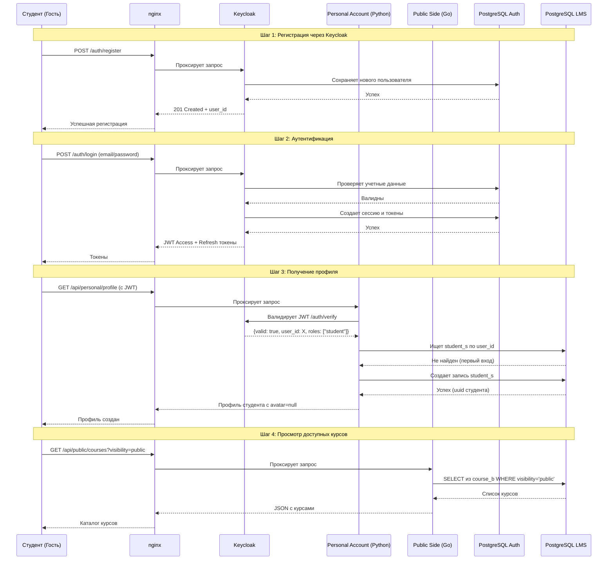

## Аутентификация


---

## Прохождение теста и получение сертификата

```mermaid
sequenceDiagram
    participant Student as Студент
    participant PA as Personal Account
    participant TS as Testing System
    participant DB as DB (testing_schema)

    Note over Student, DB: Предварительно: Студент аутентифицирован через Keycloak, имеет валидный JWT токен
    
    Student->>PA: POST /api/personal/tests/{id}/start (с JWT в заголовке)
    Note right of PA: PA уже имеет user_id из JWT<br/>или проверяет через Keycloak
    
    PA->>TS: Перенаправление запроса с user_id и test_id
    TS->>DB: Создание test_attempt_b (student_id, test_id, status='in_progress')
    DB-->>TS: attempt_id
    TS-->>Student: Тест начат, вопросы
    
    loop Ответы на вопросы
        Student->>TS: POST /api/tests/attempt/{id}/answer (с JWT)
        TS->>DB: Сохранение ответа в attempt_version (JSON)
    end

    Student->>TS: POST /api/tests/attempt/{id}/finish
    TS->>DB: Расчет балла, проверка min_point
    DB-->>TS: Результат проверки (points, min_point)
    
    alt Балл >= min_point
        TS->>DB: Создание certificate_b
        DB-->>TS: certificate_id
        TS->>DB: Обновление test_attempt_b (status='passed', point, certificate_id)
        TS-->>Student: Успех + данные сертификата
    else Балл < min_point
        TS->>DB: Обновление test_attempt_b (status='failed', point)
        TS-->>Student: Тест не пройден + рекомендации для повторения
    end
