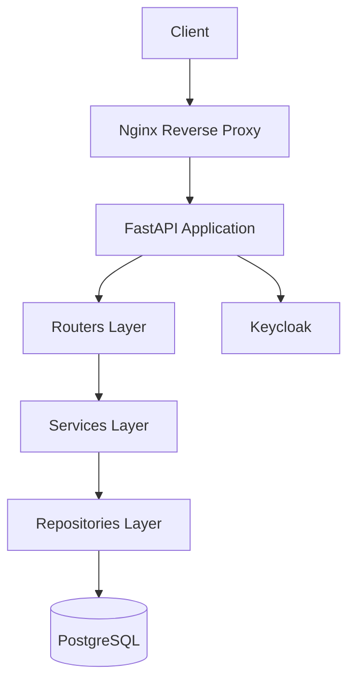
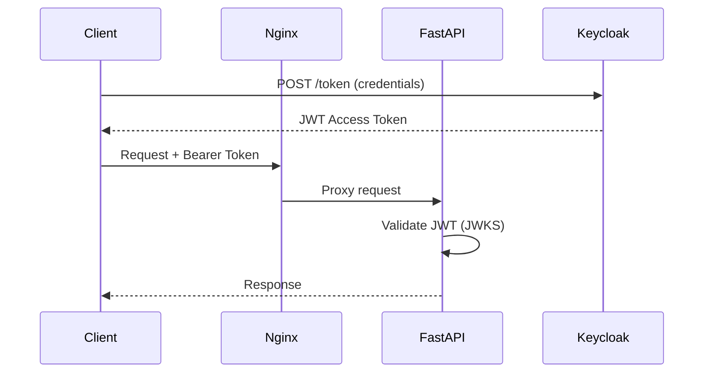

# Архитектура

## Обзор

Personal Account построен по принципу **трёхслойной архитектуры**:

## Слои приложения

### 1. Routers (Presentation Layer)

Отвечают за:

- Определение HTTP endpoints
- Валидация входных данных через Pydantic
- Авторизация через JWT токены
- Формирование HTTP ответов

Модули: `app.routers.*`

### 2. Services (Business Logic Layer)

Отвечают за:

- Бизнес-логику
- Оркестрацию вызовов репозиториев
- Трансформацию данных
- Обработку ошибок

Модули: `app.services.*`

### 3. Repositories (Data Access Layer)

Отвечают за:

- CRUD операции с БД
- SQL запросы
- Маппинг результатов

Модули: `app.repositories.*`

## Безопасность

### JWT Авторизация

Компоненты:

- `app.core.security` — валидация токенов
- `app.core.jwt` — работа с JWKS

## Observability

### OpenTelemetry

Приложение инструментировано для:

- **Трассировки** — распределённые trace через Jaeger
- **Логирования** — структурированные логи с trace_id
- **Метрик** — через OTEL Collector

Конфигурация: `app.telemetry_config`

## Конфигурация

Все настройки через переменные окружения и `.env` файл.

См. `app.config.Settings` для полного списка параметров.
