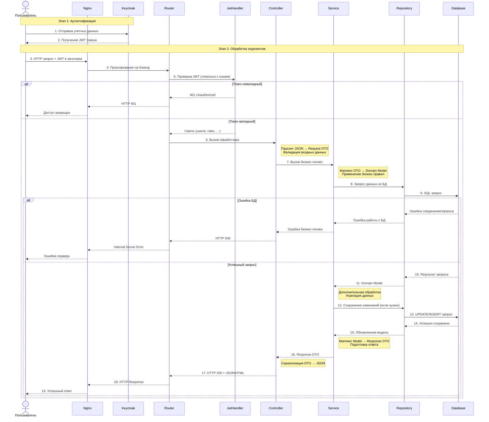

```mermaid
sequenceDiagram
    actor User as Пользователь
    participant Nginx as Nginx
    participant Keycloak as Keycloak
    participant Router as Router
    participant Auth as JwtHandler
    participant Controller as Controller
    participant Service as Service
    participant Repository as Repository
    participant DB as Database

    Note over User,Keycloak: Этап 1: Аутентификация
    User->>Keycloak: 1. Отправка учетных данных
    Keycloak-->>User: 2. Получение JWT токена

    Note over User,DB: Этап 2: Обработка эндпоинтов
    User->>Nginx: 3. HTTP запрос + JWT в заголовке
    Nginx->>Router: 4. Проксирование на бэкенд

    Router->>Auth: 5. Проверка JWT (локально с кэшем)
    alt Токен невалидный
        Auth-->>Router: 401 Unauthorized
        Router-->>Nginx: HTTP 401
        Nginx-->>User: Доступ запрещен
    else Токен валидный
        Auth-->>Router: Claims (userId, roles, …)

        Router->>Controller: 6. Вызов обработчика
        Note right of Controller: Парсинг JSON → Request DTO<br/>Валидация входных данных

        Controller->>Service: 7. Вызов бизнес-логики
        Note right of Service: Маппинг DTO → Domain Model<br/>Применение бизнес-правил

        Service->>Repository: 8. Запрос данных из БД
        Repository->>DB: 9. SQL запрос

        alt Ошибка БД
            DB-->>Repository: Ошибка соединения/запроса
            Repository-->>Service: Ошибка работы с БД
            Service-->>Controller: Ошибка бизнес-логики
            Controller-->>Router: HTTP 500
            Router-->>Nginx: Internal Server Error
            Nginx-->>User: Ошибка сервера
        else Успешный запрос
            DB-->>Repository: 10. Результат запроса
            Repository-->>Service: 11. Domain Model

            Note right of Service: Дополнительная обработка<br/>Агрегация данных

            Service->>Repository: 12. Сохранение изменений (если нужно)
            Repository->>DB: 13. UPDATE/INSERT запрос
            DB-->>Repository: 14. Успешно сохранено
            Repository-->>Service: 15. Обновленная модель

            Note right of Service: Маппинг Model → Response DTO<br/>Подготовка ответа

            Service-->>Controller: 16. Response DTO
            Note right of Controller: Сериализация DTO → JSON
            Controller-->>Router: 17. HTTP 200 + JSON/HTML
            Router-->>Nginx: 18. HTTP Response
            Nginx-->>User: 19. Успешный ответ
        end
    end
```
